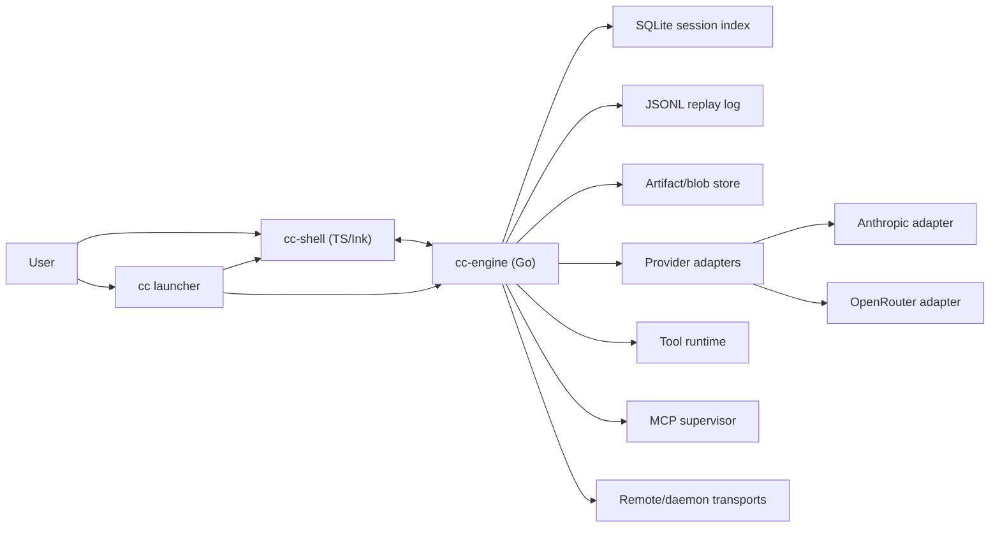

# RFC: Go Core, Thin TS Shell, Anthropic + OpenRouter

## 1. Summary

This RFC defines the target architecture for a near-full-parity rewrite of the
current Claude Code system into:

- a Go engine for runtime-critical work
- a thin TypeScript shell for UI parity and short-term migration speed
- provider-neutral contracts so Anthropic and OpenRouter are peers rather than
  special cases

The design preserves major user-facing behaviors from the current system while
removing the current Anthropic SDK type coupling, feature-flag sprawl, and
monolithic REPL/state ownership.

## 2. Goals

- Preserve user-visible workflows for local sessions, non-interactive modes,
  tools, MCP, resume, remote/assistant flows, and config semantics.
- Move hot-path runtime concerns out of the Bun/TS process.
- Replace Anthropic-specific internal types with provider-neutral engine
  contracts.
- Treat Anthropic OAuth/API-key and OpenRouter API-key as separate first-class
  auth systems.
- Make the transport, provider, tool, and session layers independently
  testable.

## 3. Non-Goals

- Bit-for-bit reproduction of current file layout, env quirks, or internal
  feature-gate behavior.
- Preservation of internal-only Anthropic commands or ant-only operational
  tooling.
- Full shell rewrite in Go for v1. The shell remains TS/Ink first, then may be
  replaced later.

## 4. Current-System Reading

The extracted source tree indicates these current responsibilities:

- `src/main.tsx` multiplexes local, SSH, remote, assistant, direct-connect,
  config boot, and command registration.
- `src/query.ts` owns the core turn loop.
- `src/services/api/client.ts` and `src/services/api/claude.ts` tightly couple
  inference to Anthropic SDK message types.
- `src/screens/REPL.tsx` mixes presentation, session control, query dispatch,
  transport adapters, and state mutation.
- `src/services/mcp/client.ts` is a large integration point that converts MCP
  into tools, resources, and auth state.

The rewrite decomposes these responsibilities instead of mirroring them.

## 5. Target Runtime Topology

### 5.1 Processes

- `cc`
  - primary launcher
  - chooses interactive or headless entrypoint
  - locates bundled `cc-engine`
- `cc-shell`
  - TS/Ink shell for interactive local and viewer-style sessions
  - owns rendering and keyboard handling only
- `cc-engine`
  - Go binary
  - owns session execution, tool runtime, provider adapters, MCP, replay,
    transports, and background work

### 5.2 Engine Modes

- embedded local session mode
- headless print/json/stream mode
- daemon mode for background sessions and local attach
- remote session host mode
- SSH/direct-connect remote engine mode

### 5.3 Shell/Engine Communication

The canonical schema is defined once and used everywhere:

- schema format: versioned JSON envelopes with generated Go and TS bindings
- local interactive transport: framed NDJSON over stdio
- local daemon attach transport: Unix domain socket with the same envelope
- remote transport: WebSocket with the same envelope

This keeps v1 debuggable and easy to integrate from TS while preserving a
single event contract across local and remote paths.

## 6. Canonical Subsystems

### 6.1 Engine

`Engine` owns:

- session lifecycle
- turn loop and compaction
- retry policy and fallback selection
- budget enforcement
- tool scheduling and tool-progress lifecycle
- session replay and resume
- background task execution

Chosen shape:

```go
type Engine interface {
    StartSession(ctx context.Context, req StartSessionRequest) (SessionHandle, error)
    SendCommand(ctx context.Context, sessionID string, cmd SessionCommand) error
    StreamEvents(ctx context.Context, sessionID string) (<-chan SessionEvent, error)
    ResumeSession(ctx context.Context, req ResumeSessionRequest) (SessionHandle, error)
    CloseSession(ctx context.Context, sessionID string, reason string) error
}
```

### 6.2 ProviderAdapter

`ProviderAdapter` owns all provider-specific translation:

- stream completion
- non-stream completion
- model listing
- token counting
- structured output support
- tool-call translation
- provider error normalization
- provider capability reporting

Chosen shape:

```go
type ProviderAdapter interface {
    Kind() ProviderKind
    ListModels(ctx context.Context, profile AuthProfile) ([]ModelDescriptor, error)
    CountTokens(ctx context.Context, profile AuthProfile, req TokenCountRequest) (TokenCountResult, error)
    StreamCompletion(ctx context.Context, profile AuthProfile, req CompletionRequest) (<-chan ProviderEvent, error)
    Complete(ctx context.Context, profile AuthProfile, req CompletionRequest) (CompletionResult, error)
    ValidateProfile(ctx context.Context, profile AuthProfile) (ProfileValidationResult, error)
    Capabilities(ctx context.Context, profile AuthProfile, model string) (CapabilitySet, error)
}
```

### 6.3 ToolRuntime

`ToolRuntime` owns:

- builtin tool registration
- concurrency classes
- permission requests
- tool execution
- projection of MCP tools/resources into the same engine surface
- large output persistence

Chosen shape:

```go
type ToolRuntime interface {
    ListTools(ctx context.Context, s SessionContext) ([]ToolDescriptor, error)
    ExecuteTool(ctx context.Context, s SessionContext, call ToolCall) (<-chan ToolEvent, error)
    ResolveResources(ctx context.Context, s SessionContext) (ResourceSnapshot, error)
}
```

### 6.4 SessionTransport

`SessionTransport` owns how commands/events move between actors:

- local shell to local engine
- viewer shell to daemon session
- remote viewer/control to remote engine
- SSH/direct-connect shell to remote engine

Chosen shape:

```go
type SessionTransport interface {
    Open(ctx context.Context, target TransportTarget) error
    Send(ctx context.Context, cmd SessionCommand) error
    Events(ctx context.Context) (<-chan SessionEvent, error)
    Close(ctx context.Context) error
}
```

## 7. Data Ownership

### 7.1 Go Owns

- session state
- message history
- tool state
- permissions state
- MCP connection lifecycle
- provider session/auth state
- replay log
- background tasks
- resume index

### 7.2 TS Owns

- rendering state
- focus and keyboard state
- viewport state
- transient UI composition
- client-side caching of event projections only

The shell may derive view models from engine events, but it is never the
source of truth for session semantics.

## 8. Storage Layout

To allow coexistence with the current tool, the rewrite uses:

- root: `~/.claude-next/`

Chosen layout:

- `config/settings.json`
- `config/project-settings.json` per project overlay
- `profiles/profiles.json`
- `policy/policy.json`
- `state/session-index.db`
- `sessions/<session_id>/events.jsonl`
- `sessions/<session_id>/artifacts/`
- `cache/models.json`
- `cache/mcp/`
- `logs/engine.log`

### 8.1 Session Index

Use SQLite for fast lookup and resume metadata:

- session id
- title
- created/updated timestamps
- cwd or repo identity
- transport kind
- last event offset
- active profile
- remote session metadata
- background status

### 8.2 Replay Log

Use append-only JSONL for replay and debugging:

- every canonical `SessionEvent` is persisted
- large payloads are externalized into content-addressed blobs in
  `artifacts/`
- replay is deterministic from event log plus blob references

This replaces the current diffuse transcript/state logic with a single source
of truth.

## 9. Session Lifecycle

### 9.1 Local Interactive

1. `cc` starts `cc-shell`
2. `cc-shell` starts `cc-engine`
3. shell sends `StartSession`
4. engine emits bootstrap, auth, tool catalog, and config events
5. shell sends user commands
6. engine runs provider/tool loop and emits events
7. session is resumable from persisted event log

### 9.2 Non-Interactive

1. `cc` starts `cc-engine` directly or via a thin launcher library
2. CLI flags are normalized into the same `StartSessionRequest`
3. engine emits stream events or returns a final structured result
4. no UI-specific state is involved

### 9.3 Remote or Viewer Session

1. shell opens a `SessionTransport` to a daemon or remote engine
2. engine remains authoritative
3. viewer sessions are flagged read-only
4. permission prompts and interrupts obey transport role policy

## 10. Command Surface Policy

### 10.1 Preserve

- major user-facing slash commands and CLI flags
- session and model control
- permissions, hooks, skills, MCP, plugin, resume, review, remote, SSH, and
  export flows

### 10.2 Simplify

- command registration is declarative, not scattered across large boot files
- internal and presentation-only commands are split cleanly
- feature-flag-dependent command mutation is reduced to capability checks

### 10.3 Drop

- internal Anthropic-only commands with no end-user value
- ant-only operational helpers
- undocumented flag combinations whose only purpose was supporting internal
  rollout machinery

## 11. Hooks and Plugins

### 11.1 Hooks

Hooks remain user-visible but are moved under engine ownership.

Chosen behavior:

- hooks run engine-side as subprocesses with typed JSON payloads
- hook phases: session start, pre-submit, post-response, stop/failure,
  compaction
- hook failures emit typed events and never corrupt session state

### 11.2 Plugins

Plugins are split into engine and shell contributions.

- engine contributions:
  - tools
  - hooks
  - MCP configs
  - background workers
- shell contributions:
  - menus
  - panels
  - presentation metadata

Plugin manifests must declare which side they contribute to. No plugin may
directly mutate engine state outside the public command/event contract.

## 12. MCP Architecture

The current MCP integration is preserved functionally but rehosted around the
canonical runtime:

- MCP servers are connected and supervised by the Go engine
- MCP tools are projected into `ToolRuntime`
- MCP resources are projected into `ResourceSnapshot`
- MCP auth state is surfaced through canonical auth and status events

Chosen v1 policies:

- MCP connections are per session unless marked reusable by config
- MCP auth sessions are cached by profile and server identity
- session-expired or 401 conditions trigger typed `auth_status` or
  `mcp_status` events, not transport-specific exceptions leaking upward

## 13. Remote, SSH, Direct-Connect, Assistant

These remain distinct transport roles over the same event model.

### 13.1 Remote Control

- remote engine is authoritative
- local shell is a client
- tool permissions may be answered locally when policy allows

### 13.2 Assistant Viewer

- viewer-only transport flag
- read-only event subscription
- no session mutation except explicit allowed actions such as send-message if
  the session role allows it

### 13.3 SSH

- engine runs remotely
- local shell connects over a secure tunnel
- auth and tool execution stay on the remote engine

### 13.4 Direct Connect

- shell connects to a trusted engine endpoint
- same event protocol as local daemon attach

## 14. Config and Policy

Use separate concepts instead of today’s env-heavy mixing:

- user settings
- project settings
- session overrides
- auth profiles
- managed policy

Chosen precedence:

1. defaults
2. user settings
3. project settings
4. session overrides
5. CLI flags
6. managed policy as an enforceable ceiling after value resolution

Policy never acts as a normal preference layer. It validates, narrows, or
blocks the resolved value.

Sensitive routing and credential settings are never loaded from project scope.

## 15. Migration Strategy

### 15.1 Coexistence

- new runtime uses `~/.claude-next/`
- importer reads current config and session history from the old layout
- no in-place mutation of current Claude Code files during initial adoption

### 15.2 Shell Migration

- phase 1 keeps TS/Ink shell for parity
- phase 2 moves more command logic into Go
- phase 3 may replace the TS shell if performance and parity allow

### 15.3 Risk Reduction

- migrate one subsystem boundary at a time
- prove parity in headless mode before interactive mode
- prove local mode before remote mode
- prove builtin tools before MCP-heavy scenarios

## 16. Operational Services

The engine owns the operational services that are currently scattered across
query, API, analytics, and shell layers.

### 16.1 Compaction

- engine-owned `CompactionService`
- responsible for token-window management, micro-compaction, summary boundaries,
  and replay-safe compact markers
- compaction emits lifecycle events so the shell can explain why a transcript
  changed

### 16.2 Retry and Fallback

- engine-owned `RetryPolicy`
- provider adapters return normalized retry classes
- fallback model selection is configured in provider policy, not hidden inside
  transport code
- retry decisions are persisted in replay events for auditability

### 16.3 Budgeting

- engine-owned `BudgetManager`
- enforces:
  - max turns
  - per-turn output budgets
  - session spend ceilings
  - provider task budgets
- budget state is part of replay and session summary snapshots

### 16.4 Telemetry and Observability

- engine-owned `TelemetrySink`
- emits structured metrics, traces, and audit events from canonical runtime
  events rather than transport- or provider-specific callbacks
- shell emits presentation-only telemetry such as render timing and key UI
  interactions
- all telemetry redaction policy is enforced in engine serializers before
  export

Chosen observability outputs:

- local structured log file
- metrics sink
- optional tracing sink
- per-session diagnostic bundle assembled from event log plus engine metrics

## 17. Architecture Diagram



## 18. Acceptance Conditions

This RFC is only considered implemented when:

- the engine shell boundary is the only runtime control plane
- provider-neutral contracts are the engine source of truth
- Anthropic and OpenRouter both work through adapter contracts
- replay/resume is event-log-driven
- local, remote, SSH, direct-connect, and viewer modes share the same event
  model
- MCP is supervised by the engine rather than ad hoc shell-owned state
- compaction, retry, budgeting, and telemetry are engine-owned operational
  services

